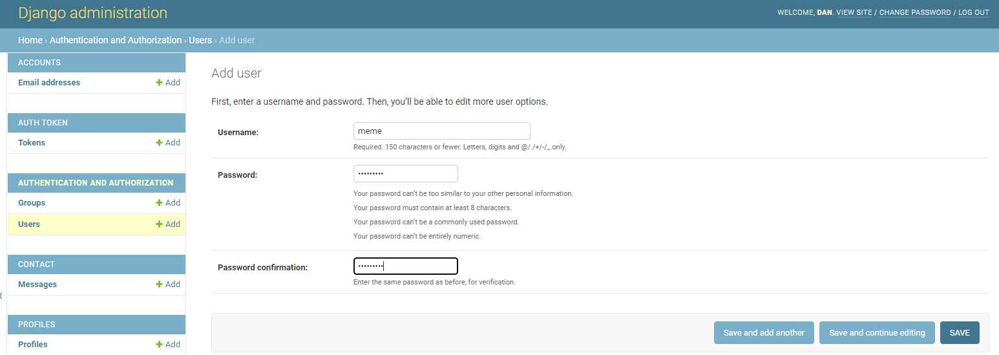
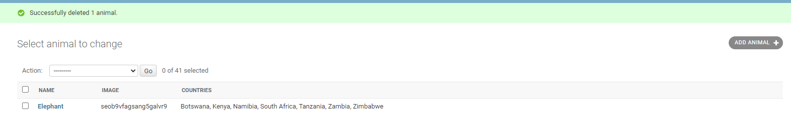

# DRF_Friends API

💻 [Live link](https://friends12.herokuapp.com/)

DRF_Friends API is the backend service application used by the [Friends Wildlife](https://friendsa.herokuapp.com).
<br>
This backend api was created for Portfolio Project nr 5. 
Diploma in Full Stack Software Development, at the [Code Institute](https://codeinstitute.net/)

## Home Page

When you first enter the API site, you are directed to the route Hompage, with a "message": "Welcome to my backend api for Friends Network!".


<hr>

## Table of Contents
* [Homepage](#home-page)
* [Agile Planning](#agile-planning)
    * [User Stories](#user-stories)
    * [Epics](#epics)
* [API End Points](#api-endpoints)
* [Security](#security)
* [Technologies Used](#technologies-used)
* [Testing](#testing)
* [Database](#database)
* [Deployment](#deployment) 
    * [Heroku Deployment](#heroku-deployment)
    * [Fork Project](#forking)
    * [Credits](#credits)
    * [Acknowledgements](#acknowledgements)


## Development Goals

The purpose of this API is to provide a backend service to allow the Friends users front end applications to render, Create, Read, Update and Delete operations via the user interface.


## Agile Planning

This project was developed using agile methodologies and features in incremental loop. 

Stories were assigned to epics, prioritized under the Todo, In progress, and Done. It was done this way to ensure that all requirements were completed first to give the project a balance, with features being added one after the other..

The Kanban board was created using github projects and can be located [here](https://github.com/users/email2ify/projects/13/views/1) and can be viewed to see more information on the project cards.The documentation tasks have an acceptance criteria in order to define the functionality that marks that story as done or in progress.


## Epics

**Set Up**

This aspect covers all the initial setup of the Django application and Django REST Framework and coding features.

**Posts**

* This aspect covers all API endpoint creation and database connections relating to the CRUD functionality of user posts.

**Comments**

This aspect covers all API endpoint creation and database connections relating to the CRUD functionality of user comments in relation to posts.
* The Comment model contains the following fields: owner, task, created_on, updated_on and comment_body
* ForeignKey relation between the ownner and User id field
* ForeignKey relation between the task and Task id field

**Profiles**

* This aspect covers all API endpoint creation and database connections relating to all profile posts.

**User**

* This aspect covers all API endpoint creation and database connections relating to the CRUD functionality of users who register.
* ForeignKey relation with the Comment model owner
* The User model contains information about the user. It is part of the Django allauth library.
* One-to-one relation with the Profile model owner field

**Contact**

* This aspect covers all API endpoint creation and database connections relating to inquiries recieved by users.
* The Contact model contains the following fields: reason, name, email, message and
message date

**Animals**

* This aspect covers all API endpoint creation and database for animals and african countries.

## User Stories

The back-end section deals on its administration side.
My user story:
* As an admin, I want to be able to create, edit and delete users, add species, countries, comments , so that I can take care of the application content,used by the frontend users and also remove any inappropriate content sent by users on the general enquiring form.

**By Epics** 

**Setup**

* Create the google cloud and create the connection to the project so that static images can be uploaded by users.

* Create a new account so that I can access all the features for signed up users


**Posts**

* For user, to be able to view edit or delete a post
* For user, to able to create a post and list posts

**Profiles**

* I needed to create a new blank profile with default image when a user is created.
* I needed to create list of profiles diplaying on a list

**Contact**

* For user, to be able to fill in form of enquiries 
* For user, to able to fill in form of deleting of user account

**Animal**

* For user, to be able to see list of animals 
* For user, to able to to see list of african countries

### API-Endpoints

User Story:

* User can create a base project set up so that I can build out the features.`

Implementation:
The settings were also edited to hide any secret variables and set dev and production environments.

User Story:

* Create the google cloud and create the connection to the project so that static images can be uploaded by users.

Implementation:

* A google cloud bucket was created and a service account created to allow image uploads via the service account.


User Story:

* As a user I can create a new account so that I can access all the features for signed up users

Implementation:

* Django rest framework and dj_rest_auth were installed and added to the url patterns and site packages to make use of their built in authentication system.

User Story:

* Create api views, so that they are available to the front end

Implementation:

Methods:
* POST - Used to create a users
* GET - Used to retrieve a list of users

Endpoint: /users/<int:pk>/

Methods:
* GET - Used to view single user profile
* PUT - Used to update user profile
* DELETE - Used to delete user profile


User Story:

As a user, I want to be able to view edit or delete a post

As a user, I want to able to create a post and list posts

Implementation:

Endpoint: /posts/

Methods:
* POST - Used to create post
* GET - Used to get a list of posts

Endpoint: /posts/<int:pk>/

Methods:
* GET - Get a single post
* PUT - Used to update a single post
* DELETE - Used to delete a post


User Story:

 I want user to be able to get profile posts

Implementation:

Endpoint: /profiles/

Methods:

* GET - Used to get profile posts

Endpoint: /profiles/<int:pk>/

Methods:
* GET - Get a single profile


## Security

A permissions class was added called "IsOwnerOrReadOnly" to ensure only users who create the content are able to edit or delete it and the GCP IAMS permissions for service account.
to minimum permissions granted.

## Technologies Used

* Git
    * Used for version control
* Github
    * Repository for storing code base and docs
* Django
    * Main framework used for application creation
* Django REST Framework
    * Framework used for creating API
* Heroku
    * Used for hosting the application


## Libraries & Tools

- [Cloudinary](https://cloudinary.com/) - File storage. Justification: I used this to store static files
- [Graphviz](https://dreampuf.github.io/GraphvizOnline/) - Image generator. Justification: I used this used for the database model diagram
- [Git](https://git-scm.com/) - Version control system. Justification: I used this for version control and to push the code to GitHub
- [GitHub](https://github.com/) - Cloud based hosting service. Justification: I used this as a remote repository to store project code
- [Gitpod](https://gitpod.io/workspaces) - Cloud development environment. Justification: I used this to host a virtual workspace
- [Heroku](https://heroku.com) - Cloud platform. Justification: I used this was used to deploy the project into live environment
- [Django REST Framework](https://www.django-rest-framework.org/) - API toolkit. Justification: I used this to build the back-end API
- [Django AllAuth](https://django-allauth.readthedocs.io/en/latest/index.html) - API Module. Justification: I used this for user authentication
- [Psycopg2](https://www.psycopg.org/docs/) - PostgreSQL database adaptor. Justification: This was used as a PostgreSQL database adapter for Python
- [ElephantSQL](https://www.elephantsql.com/) - Database hosting service – Justification: This was used as the deployed project on Heroku uses an ElephantSQL database

##### Back to [top](#table-of-contents)


## Validation

### Python Validation

PEP8 [Pycodestyle](https://pypi.org/project/pycodestyle/) was used for errors and warnings.

All folders were run through flake8. Several issues appeared with various reasons, lines too long, blank spaces, indentation and docstrings.

**Bugs and their fixes**
 
 500 error as a bug occurred on post and profile form submissions, which was later removed the dublicate causing the errors


## Python Packages

<details open>
   
<summary> Details of packages </summary>

* dj-database-url==1.0.0
    * Used to parse the DATABASE_URL connection settings
* dj-rest-auth==2.2.5
    * Used with auth system
* Django==4.1.1
    * Main framework used to start the project
* django-allauth==0.50.0
    * Used for authentication
* django-cors-headers==3.13.0
    * Used for Cross-Origin Resource Sharing (CORS) headers to responses
* django-filter==22.1
    * Used to filter API results in serializers
* django-storages==1.13.1
    * Used to help connect with the google cloud storage bucket
* djangorestframework==3.13.1
    * Framework used to build the API endpoints
* djangorestframework-simplejwt==5.2.0
    * Used with djange rest framework to create access tokens for authentication
* gunicorn==20.1.0
    * Used for deployment of WSGI applications
* Pillow==9.2.0
    * Imaging Libray - used for image uploading
* psycopg2==2.9.3
    * PostgreSQL database adapter to allow deployed application to perform crud on the postgresql db
* PyJWT==2.5.0
    * For creating the Python Json Web Tokens for authentication

Installed as package dependcies with above installations:
* asgiref==3.5.2
* autopep8==1.7.0
* cachetools==5.2.0
* certifi==2022.6.15.1
* cffi==1.15.1
* charset-normalizer==2.1.1
* cryptography==38.0.1
* defusedxml==0.7.1
* idna==3.3
* oauthlib==3.2.1
* protobuf==4.21.5
* pyasn1==0.4.8
* pyasn1-modules==0.2.8
* pycodestyle==2.9.1
* pycparser==2.21
* python3-openid==3.2.0
* pytz==2022.2.1
* requests==2.28.1
* requests-oauthlib==1.3.1
* rsa==4.9
* six==1.16.0
* sqlparse==0.4.2
* toml==0.10.2
* types-cryptography==3.3.23
* tzdata==2022.2
* urllib3==1.26.12

</details>

##### Back to [top](#table-of-contents)

## Testing

The following tests were carried out on the app:

### Manual testing of user stories

- As an admin, I want to be able to create, edit and delete the users, posts, comments and likes, remove country or add animal so that I can have a control over the content of the application.

**Test** | **Action** | **Expected Result** | **Actual Result**
-------- | ------------------- | ------------------- | -----------------
User | Create, update & delete user | A user can be created, edited or deleted | Works as expected
User | Change permissions | User permissions can be updated | Works as expected
Profile | Create, update & delete | User profile can be created, edited or deleted | Works as expected
Comment | Create, update & delete | A comment can be created, edited or deleted | Works as expected
Contact | Create & delete | A Contact message can be created or deleted | Works as expected
Animals | Create & delete | An animal can be created,just by uploading images or deleted | Works as expected
Animals/Countries | Create & delete | From the data lists of countries, a country can be added (created) or remove (deleted) | Works as expected

<details><summary>Screenshots - USER</summary>
    <details><summary>Create user</summary>
    
    <br>
    
    <br>
    
    <br>
    </details>
</details>

<details><summary>Screenshots - PROFILE</summary>
    <details><summary>Update profile</summary>
    
    <br>
    
    <br>
    
    <br>     
    </details>
    <details><summary>Delete profile</summary>
    
    <br>
    
    <br>
    
    <br>
    </details>
</details>


<details><summary>Screenshots - COMMENT</summary>
    <details><summary>Create comment</summary>
    
    <br>
    
    <br>
    
    <br>
    </details>
    <details><summary>Update comment</summary>
    
    <br>
    
    </details>
    <details><summary>Delete comment</summary>
    
    <br>
    </details>
</details>

<details><summary>Screenshots - CONTACT</summary>
    <details><summary>Create - Contact message</summary>
    
    <br>
    
    <br>
    </details>
    <details><summary>Delete - Contact message (superuser only)</summary>
    
    <br>
    
    <br>
    
    <br>
    </details>
</details>

<details><summary>Screenshots - ANIMAL</summary>
    <details><summary>Create Animal</summary>
    
    <br>
    
    <br>
    
    <br>
    
    <br>
    </details>
    <details><summary>Edit Animal</summary>
    
    <br>
    
    <br>
    </details>
    <details><summary>Delete Animal</summary>
    
    <br>
    
    <br>
    </details>
</details>

### Automated testing

Automated testing was done using the Django Rest Framework APITestCase.

- Tests 

<details><summary>Reports Testing</summary>


</details>

<details><summary>Combined Report</summary>

</details>

## Database

**Dbeaver Entity Relationship Diagram**

The image models representing the database structure of the application.
It was generated using the Dbeaver ER diagram and the link for the tutorial  [Download instruction here](https://technology.amis.nl/database/quick-start-with-free-managed-postgresql-database-on-elephantsql/)

<br>


https://dbeaver.com/

## Version Control

The site was created using the Visual Studio Code editor and pushed to github to the remote repository.

The following git commands were used throughout development to push code to the remote repo:

```git add <file>``` - This command was used to add the file(s) before they are committed.

```git commit -m “commit message”``` - This command was used to commit changes to the local repository.

```git push``` - This command was used to push all committed code to the remote repository on github.

## Deployment

## Heroku Deployment

The site was deployed to Heroku with the following steps:

* Navigate to heroku and create an account
* Click the new button in the top right corner
* Select create new app
* Enter app name
* Select region and click create app
* Click the resources tab and search for Heroku Postgres
* Select hobby dev and continue
* Go to the settings tab and then click reveal config vars
* Add the following config vars:
  * SECRET_KEY: (Your secret key)
  * DATABASE_URL: (This should already exist)
  * ALLOWED_HOST:
  * CLIENT_ORIGIN: url for the client front end react application that wil be making requests to these APIs
  * CLIENT_ORIGIN_DEV: address of the local server used to preview and test UI during development of the front end client application

* Click the deploy tab
* Scroll down to Connect to GitHub and sign in , authorize when prompted
* In the search box, find the repositoy you want to deploy and click connect
* Scroll down to Manual deploy and choose the main branch
* Click deploy

##### Back to [top](#table-of-contents)


## Forking

Most commonly, forks are used to either propose changes to someone else's project or to use someone else's project as a starting point for your own idea.

- Navigate to the GitHub Repository you want to fork.

- On the top right of the page under the header, click the fork button.

- This will create a duplicate of the full project in your GitHub Repository.


## Credits

Code Institute on Walkthrough project ['Moments'](https://github.com/Code-Institute-Solutions/drf-api).

## Acknowledgements

My Mentor Daisy 

##### Back to [top](#table-of-contents)
